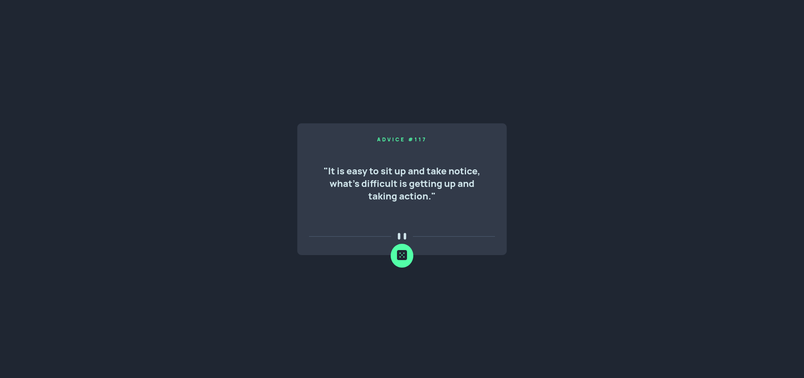

# Frontend Mentor - Advice generator app solution

This is a solution to the [Advice generator app challenge on Frontend Mentor](https://www.frontendmentor.io/challenges/advice-generator-app-QdUG-13db). Frontend Mentor challenges help you improve your coding skills by building realistic projects.

## Table of contents

- [Overview](#overview)
  - [The challenge](#the-challenge)
  - [Screenshot](#screenshot)
  - [Links](#links)
- [My process](#my-process)
  - [Built with](#built-with)
  - [What I learned](#what-i-learned)
  - [Useful resources](#useful-resources)
- [Author](#author)

## Overview

### The challenge

Users should be able to:

- View the optimal layout for the app depending on their device's screen size
- See hover states for all interactive elements on the page
- Generate a new piece of advice by clicking the dice icon

### Screenshot

### Links

- Solution URL: [Add solution URL here](https://your-solution-url.com)
- Live Site URL: [Add live site URL here](https://your-live-site-url.com)

## My process
I started with the HTML, which was simple enough, then went on to the CSS and learned letter spacing. For the JS, it took some searching to fix the API giving me the same advice, except on refresh. The solution being tieing the fetch to a Math.random method. All in all, a fun and not too difficult project!

### Built with

- Semantic HTML5 markup
- CSS custom properties
- Flexbox
- Mobile-first workflow
- API's

### What I learned

I learned about letter spacing, and being able to tie a fetch to Math.random()

### Useful resources

- [Stack Overflow](https://stackoverflow.com/questions/71255840/fetch-api-return-same-data-always) - This post helped me decipher the issue I had with the API returning the same advice every time it was called.

## Author

- Website - [Nathan Rhodes](https://github.com/Meobot)
- Frontend Mentor - [@Meobot](https://www.frontendmentor.io/profile/meobot)
- Twitter - [@meobot](https://www.twitter.com/meobot)